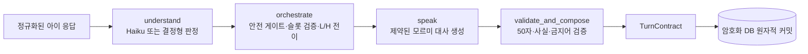

# 모르미 대화 API 아키텍처

## 1. 책임 경계

이 API는 카페 화면 전체를 그리지 않지만, **카페 세션의 교육적 진행 전체**를 담당한다.

백엔드가 결정하는 것:

- 현재 스테이지와 하위 과제
- 현재 발화사다리 L, 힌트사다리 H, 하위 목표
- 응답 판정과 검증된 사실 슬롯
- 다음 질문, 입력 방식, 도움 카드, 시각 자료 종류
- 과제 완료와 다음 과제 진입
- 별노트 문장과 귀속
- 학습자별 다음 시작 L과 최근 H 사용 근거

프론트엔드가 담당하는 것:

- 배경, 모르미 캐릭터, 말풍선, 도움 카드 렌더링
- 선택지, 수 세기, 세로식 등 조작 UI
- 음성 인식이 추가될 경우 STT 실행과 ASR confidence 전달
- TurnContract가 지정한 입력 외의 정답 판정은 하지 않음

## 2. LangGraph 턴 워크플로



LangGraph에는 per-turn 임시 상태만 흐른다. 아이 원문을 LangGraph 체크포인터에 다시 저장하지 않는다. 영속 세션 상태와 원문 기록은 암호화 애플리케이션 DB가 단일 기준이다.

## 3. 발화사다리와 힌트사다리

설계 원본의 L4~L0, H0~H3을 별도 상태값으로 유지한다.

- 표현 막힘: `L↓`, `H 유지`
- 개념 오답/막힘: `L 유지`, `H↑`
- 부분 성공: 검증된 슬롯을 유지하고 빠진 슬롯 하나 요청
- 입력 인식 오류: L/H 모두 유지
- H2에서도 관계 연결 실패: H2를 유지하며 L1로 단계 분해
- L1-H2에서도 실패: L0-H3 공동 수행

힌트는 자동 공개되는 `help_card`가 제공한다. 모르미 대사는 카드 내용을 자신의 지식처럼 말하지 않는다.

## 4. 자연스러운 전환

발화사다리 하강은 다음 구조를 사용한다.

1. 아이 반응을 실패로 규정하지 않음
2. 모르미가 질문 방식의 부담을 책임짐
3. 같은 문제와 숫자를 유지함
4. 더 작은 도움 하나만 요청함

예:

- L4→L3: “내가 한꺼번에 많이 물어봤네. 어느 줄인지 먼저 알려줘.”
- L3→L2: “말로만 들으려니 내가 헷갈려. 같이 골라볼까?”
- L2→L1: “어디부터 볼지 몰랐네. 사람 수부터 하나씩 볼까?”
- L1→L0: “도움 카드 순서대로 나와 같이 해볼까?”

## 5. 사실 슬롯과 원문

```text
암호화 원문 기록: 질문 + 아이 원문/선택
학습 상태: 검증된 슬롯만
화자 LLM: 검증 슬롯 + 빠진 슬롯 + 허용된 아이 표현만
별노트: 완결되고 사실인 직접 설명 또는 검수된 공동 문장
```

안전하고 모든 사실이 맞는 발화는 한 턴 동안 `quote_safe`, 안전하지만 오답이 섞인 발화는 수량을 가린 `context_only`, 위험·개인정보·해킹 발화는 `none`으로 화자에게 전달한다.

## 6. 실패 정책

- 분류기 실패: 상태를 바꾸지 않고 503 반환
- 화자 실패: 결정된 교육 진행은 유지하고 검수된 fallback 대사 사용
- 출력 검증 실패: 검수된 fallback 대사 사용
- 동일 `response_id` 재전송: 상태를 중복 진행하지 않고 최초 생성된 결과 턴 반환
- 오래된 `turn_id`: 409 반환
- 부분 오답: 맞은 슬롯만 저장하고 틀린 슬롯은 저장하지 않음

## 7. 저장

주요 테이블:

- `conversations`: 구조화된 최신 교육 상태
- `turns`: 암호화 질문·원문 응답과 구조화 판정
- `learner_profiles`: 기술별 안정 L, H0 성공, 최근 최대 H
- `practice_results`: 집 반복 결과
- `notes`: 별노트 문장과 직접/공동 귀속

운영에서는 PostgreSQL, 원문 암호화 키, 서비스 API 키를 강제한다.

아이 원문은 `conversation_storage_consent=true`일 때만 암호화 저장한다. 질문은
최신 화면 복구에 필요하므로 항상 암호화 저장하되, 턴 계약 JSON에는 평문을 중복
저장하지 않는다. `response_id`의 멱등 결과는 기본 30일간 보존한다.
