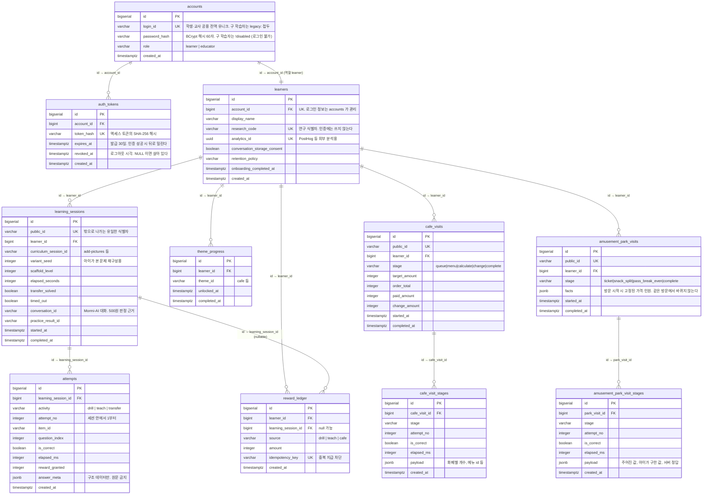

# 데이터 모델과 학습자 격리

`V1__init.sql` ~ `V15__amusement_park_visits.sql` 기준. 스키마를 바꾸면 이 문서도 같이 고친다.

## ERD



## 관찰·집계·리포트 (V6~V10, 이슈 #6)

```mermaid
erDiagram
    observation_events ||--o{ learning_observations : "id → observation_event_id"
    observation_events ||--o{ star_notes : "id → observation_event_id"
    learners ||--o{ learning_observations : "id → learner_id"
    learners ||--o{ star_notes : "id → learner_id"
    learning_sessions ||--o{ star_notes : "id → learning_session_id (nullable)"
    learners ||--o{ learning_task_outcomes : "id → learner_id"
    learning_sessions ||--o{ learning_task_outcomes : "id → learning_session_id"
    organizations ||--o{ educators : "id → organization_id"
    organizations ||--o{ cohorts : "id → organization_id"
    accounts ||--|| educators : "id → account_id (역할 educator, 구 명부 행은 NULL)"
    cohorts ||--o{ cohort_research_codes : "id → cohort_id"
    educators ||--o{ cohort_research_codes : "id → issued_by"
    cohorts ||--o{ learner_enrollments : "id → cohort_id"
    learners ||--o{ learner_enrollments : "id → learner_id"
    learners ||--o{ consent_records : "id → learner_id"
    learners ||--o{ report_snapshots : "id → learner_id (nullable)"
    cohorts ||--o{ report_snapshots : "id → cohort_id (nullable)"

    observation_events {
        bigserial id PK
        varchar   event_id UK "AI가 부여한 멱등 키"
        varchar   schema_version
        varchar   event_type
        jsonb     payload "받은 그대로. 실패 이벤트 재처리 근거"
        varchar   status "received | processed | failed"
        text      error_message
        timestamptz received_at
        timestamptz processed_at
    }

    learning_observations {
        bigserial id PK
        bigint    observation_event_id FK
        varchar   ai_observation_id UK "AI 원본 추적. 재전송돼도 한 행"
        bigint    learner_id FK "대화 기록에서 역참조. 이벤트 값을 믿지 않는다"
        bigint    learning_session_id FK "null 가능"
        bigint    cafe_visit_id FK "null 가능"
        varchar   expression_before "원본 발화사다리: 신규 L4/L3/L2/L0, legacy L1 허용"
        varchar   expression_after "조회·집계 시 legacy L1은 L2로 해석"
        varchar   hint_before "힌트사다리 H0~H3"
        varchar   hint_after
        varchar   response_category
        varchar   concept_result "not_assessed 는 오답으로 합산 금지"
        varchar   bottleneck_candidate "후보일 뿐. 확정 오개념 아님"
        boolean   help_used "NULL = 수집 안 됨. false 와 다름"
        boolean   system_error "아동 수행 실패와 분리 집계"
        timestamptz observed_at
    }

    learning_task_outcomes {
        bigserial id PK
        bigint    learner_id FK
        bigint    learning_session_id FK
        varchar   task_key "attempts.item_id 와 같은 값. (세션, task_key) UNIQUE"
        boolean   first_try_success "attempts 파생. 근거 없으면 NULL"
        boolean   retry_success
        boolean   success_after_help "관찰 없으면 NULL"
        varchar   expression_lowest "가장 많이 내려간 발화 단계"
        varchar   hint_max "가장 높이 올라간 힌트 단계"
        varchar   completion_outcome "system_failure 는 아동 실패와 분리"
        integer   bottleneck_evidence_count "1 이면 단일 관찰"
        bigint_arr source_attempt_ids "근거 추적"
        bigint_arr source_observation_ids
        varchar   aggregation_rule_version
    }

    star_notes {
        bigserial id PK
        bigint    observation_event_id FK "마지막으로 반영된 수신 이벤트"
        varchar   note_id UK "AI 원본 추적. 다른 event_id 로 재전송돼도 한 행"
        integer   note_version "같거나 낮은 버전의 재발행은 무시"
        bigint    learner_id FK "대화 기록에서 역참조. 이벤트 값을 믿지 않는다"
        bigint    learning_session_id FK "null 가능"
        varchar   conversation_id
        varchar   skill_id
        text      note_text "AI 원문 그대로. BE 가 재작성하지 않는다"
        varchar   attribution "child 등. AI 원문 그대로"
        varchar   attribution_label
        varchar   evidence
        jsonb     evidence_links "의도적으로 FK 없음. 관찰보다 먼저 도착해도 수용(순서 역전)"
        boolean   active "false = 목록에서 숨김. 행은 지우지 않는다"
        timestamptz note_created_at "AI 생성 시각. 목록 정렬 키"
        timestamptz created_at
    }

    consent_records {
        bigserial id PK
        bigint    learner_id FK
        varchar   scope "conversation_storage 등"
        varchar   policy_version "동의 문서 버전. 백필은 pilot-baseline"
        boolean   granted
        timestamptz collected_at
        varchar   collected_by "참여 번호를 발급한 교사 표식. 모르면 NULL"
        timestamptz withdrawn_at "철회는 행 삭제가 아니라 이 기록"
    }

    report_snapshots {
        bigserial id PK
        bigint    learner_id FK "cohort_id 와 XOR"
        bigint    cohort_id FK
        timestamptz period_start
        timestamptz period_end
        jsonb     body "LLM 없이 성립하는 구조화 리포트"
        bigint_arr source_observation_ids "생성 시점 근거 고정"
        varchar   aggregation_rule_version
        varchar   llm_model "NULL = LLM 미사용"
        varchar   approval_status "draft | edited | approved"
    }
```



- `learning_task_outcomes` 는 파생 테이블이다. 원본은 attempts 와 learning_observations 이고, 관찰이 늦게 도착하면 같은 규칙으로 다시 계산해 덮어쓴다.
- `report_snapshots` 는 반대로 불변이다. 생성 시점의 근거 ID 를 고정해 교사가 승인한 리포트의 근거가 나중에 바뀌지 않게 한다.
- 집계·리포트의 불리언 NULL 은 전부 '수집 안 됨'이다. false(근거를 보고 아니라고 판단)와 다르며, 화면·분석에서 0/false 로 합치면 안 된다.

`attempts`, `cafe_visit_stages`, `amusement_park_visit_stages`에는 `learner_id`가 없다. 각각 부모(`learning_sessions`, `cafe_visits`, `amusement_park_visits`)를 통해서만 도달하고, 그 부모가 학습자에 묶여 있다.

지갑 잔액 컬럼은 없다. `reward_ledger`의 합계로 도출한다(`RewardLedgerRepository.sumAmountByLearnerId`). 잔액을 따로 들고 있으면 원장과 어긋날 수 있어서다.

## 아이별 데이터가 섞이지 않는 이유

세 겹으로 막는다. 하나가 뚫려도 다음이 막는다.

**1. 토큰이 계정을, 계정이 학습자를 특정한다**

`POST /v1/auth/login`이 로그인마다 다른 액세스 토큰을 발급하고, DB에는 해시만 남긴다(`auth_tokens.token_hash`, UNIQUE). 요청이 오면 `AuthTokenFilter`가 `AuthService.authenticate()`에 넘기고, 거기서 토큰을 해시해 행을 찾은 뒤 폐기·만료 여부까지 확인해 `AccountPrincipal(accountId, role, subjectId, tokenId)`로 심는다. 토큰이 없거나 죽었으면 401이다. 계정 역할이 `ROLE_LEARNER`/`ROLE_EDUCATOR` 권한이 되어, 교사 토큰으로 학습 경로를 부르거나 학생 토큰으로 학급 경로를 부르면 403이다.

행이 계정당 여러 개일 수 있어 기기를 두 대 써도 서로를 밀어내지 않는다. 대신 로그아웃은 그 요청에 쓰인 토큰만(`AccountPrincipal.tokenId`), 전체 로그아웃은 계정의 모든 행을 폐기한다.

비밀번호는 BCrypt 해시(`accounts.password_hash`)로만 보관하고, 로그인 실패 응답은 아이디가 없을 때와 비밀번호가 틀릴 때가 같다. `research_code`는 연구 식별자로만 남고 인증에는 관여하지 않는다. V13 이전에 연구 코드로만 온보딩한 학습자는 `legacy:` 접두 아이디와 `!disabled` 해시(BCrypt 형식이 아니라 어떤 비밀번호와도 매칭 불가)를 가진 계정이 채워져, 데이터는 남되 로그인 경로만 없다.

**2. 컨트롤러는 클라이언트가 보낸 learner_id를 믿지 않는다**

서비스에 넘어가는 `learnerId`는 요청 본문이 아니라 인증된 토큰에서 나온다. 프런트가 남의 `learner_id`를 적어 보내도 무시된다.

**3. 남의 세션에 쓰려 하면 403이다**

세션·카페 방문을 건드리는 모든 경로가 `requireOwned()`를 먼저 지난다.

```java
public LearningSession requireOwned(Long learnerId, String publicId) {
    LearningSession session = sessionRepository.findByPublicId(publicId)
            .orElseThrow(() -> ApiException.notFound("학습 세션을 찾을 수 없습니다."));
    if (!session.getLearnerId().equals(learnerId)) {
        throw ApiException.forbidden("다른 학습자의 세션입니다.");
    }
    ...
}
```

`CafeService`도 같은 방식으로 방문 소유권을 확인한다. 조회 쿼리 역시 전부 `learner_id`로 스코프된다(`findByLearnerId...`, `sumAmountByLearnerId`).

**중복 지급 차단은 별도다.** `reward_ledger.idempotency_key`가 UNIQUE라, 같은 보상이 두 번 들어오면 DB가 거부한다. 네트워크 재시도로 500원이 두 번 나가지 않는다.

## 저장하지 않는 것

- 아이 이름은 `display_name`에만 두고 분석 이벤트로 내보내지 않는다
- 자유 발화 원문과 음성은 이 스키마에 넣지 않는다. `answer_meta`·`payload`에는 정오·시간·선택지 id·화폐별 개수 같은 구조 데이터만 넣는다
- 대화 원문은 Mormi-AI 저장소가 동의 상태와 보존 기간을 적용해 암호화 보관한다

## 시연 중 확인용 쿼리

BE EC2에서 psql을 띄운다. 별도 설치 없이 컨테이너로 쓴다.

```bash
set -a; . /etc/mormi-backend/mormi.env; set +a
docker run --rm -it -e PGPASSWORD="$DB_PASSWORD" postgres:16-alpine \
  psql -h "$DB_HOST" -U "$DB_USERNAME" -d "$DB_NAME"
```

**아이가 실제로 만들어졌는지**

```sql
SELECT id, display_name, research_code, created_at
FROM learners ORDER BY id DESC LIMIT 10;
```

**한 아이의 진행이 쌓이는지** (`:id`를 위에서 본 값으로)

```sql
SELECT s.id, s.curriculum_session_id, s.completed_at,
       count(a.id) AS attempts,
       count(*) FILTER (WHERE a.is_correct) AS correct
FROM learning_sessions s
LEFT JOIN attempts a ON a.learning_session_id = s.id
WHERE s.learner_id = :id
GROUP BY s.id ORDER BY s.id DESC;
```

**보상 원장과 지갑 잔액**

```sql
SELECT source, amount, idempotency_key, created_at
FROM reward_ledger WHERE learner_id = :id ORDER BY id DESC;

SELECT COALESCE(sum(amount), 0) AS wallet FROM reward_ledger WHERE learner_id = :id;
```

**가르치기 500원이 나갔는지** — `source = 'teach'` 행이 있으면 Mormi-AI 판정까지 이어진 것이다.

```sql
SELECT s.public_id, s.conversation_id, r.source, r.amount
FROM learning_sessions s
LEFT JOIN reward_ledger r ON r.learning_session_id = s.id AND r.source = 'teach'
WHERE s.learner_id = :id AND s.completed_at IS NOT NULL
ORDER BY s.id DESC;
```

`conversation_id`가 비어 있으면 프런트가 대화를 안 열었거나 AI 연결이 꺼진 세션이다. 값은 있는데 `amount`가 비어 있으면 백엔드가 AI에 재확인했지만 완료로 판정되지 않은 것이다.

**아이별로 섞이지 않았는지**

```sql
SELECT l.id, l.display_name,
       count(DISTINCT s.id) AS sessions,
       COALESCE(sum(r.amount), 0) AS wallet
FROM learners l
LEFT JOIN learning_sessions s ON s.learner_id = l.id
LEFT JOIN reward_ledger r ON r.learner_id = l.id
GROUP BY l.id ORDER BY l.id DESC;
```

아이마다 자기 행에만 숫자가 붙어야 한다.
