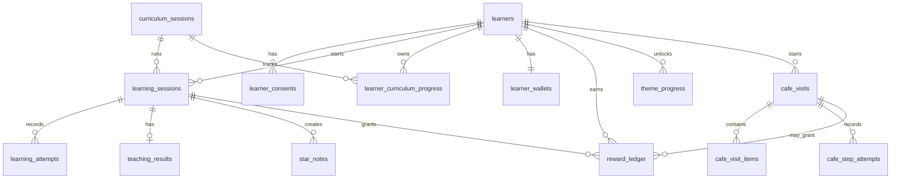

# Mormi MVP Data/API Design

> Status: MVP implementation baseline
> Date: 2026-08-12
> Scope: 대상자 테스트를 위한 Spring Boot + PostgreSQL 일반 서비스 백엔드

## 1. 저장해야 하는 데이터

MVP의 저장 목적은 네 가지다.

1. 대상자별로 앱을 다시 열어도 진행도를 복구한다.
2. 학습 세션의 반복문제, 가르치기, 별노트, 보상 결과를 리포트로 보여준다.
3. 카페 해금과 카페 미션 진행 상태를 서버 기준으로 판정한다.
4. AI 대화 서비스에는 필요한 요약만 전달하고, 아이 자유발화 원문은 기본 저장하지 않는다.

### 반드시 저장

| 영역 | 저장 데이터 | 이유 |
|---|---|---|
| 대상자 | `learner_id`, 표시 이름, 연구 코드, 생성 시각, 테스트 토큰 해시 | 온보딩, 기기 변경/재접속, 대상자 구분 |
| 동의 | 개인정보/대화 원문 보관 동의, 보관 정책 | 아동 데이터 보호와 AI 대화 원문 저장 여부 판단 |
| 커리큘럼 | 세션 ID, 과목, 단원, 제목, 레벨, 카페 필수 여부 | 진행도/리포트/해금 계산의 기준 |
| 학습 세션 | 시작/완료 시각, 상태, 세션 ID, 숙달 목표, 제한시간 초과 여부 | 중단 복구와 완료 판정 |
| 반복문제 시도 | 문제 번호, 활동 종류, 시도 번호, 정답 여부, 선택 답, 오답 횟수, 보상, 소요 시간 | 리포트 지표와 보상 계산 |
| 가르치기 결과 | AI 대화 ID, 성공 여부, 성공 사다리 단계, 도움 사용 여부, 동조/오개념 플래그 | 리포트와 500원 보상 |
| 별노트 | 최종 문장, 귀속(`child/coauthored`), 근거, 연결 학습 세션 | 어른 리포트와 학습 회고 |
| 지갑/보상 | 원장 행, 금액, 출처, 멱등 키, 잔액 스냅샷 | 중복 지급 방지 |
| 테마 진행 | 테마 ID, 해금/완료 시각 | 카페 잠금/해금 |
| 카페 방문 | 방문 상태, 단계, 선택 메뉴, 주문 합계, 낸 돈, 거스름돈, 완료 시각 | 카페 미션 중단 복구와 결과 확인 |
| 카페 단계 시도 | 단계, 정답 여부, 구조화된 답안 JSON | 줄 서기/계산/거스름돈의 리포트 가능성 |

### 저장하지 않거나 기본 비활성

| 데이터 | 정책 |
|---|---|
| 아이 자유발화 원문 | 기본 미저장. 동의가 있을 때만 AI 서비스의 암호화 저장소에 제한 기간 보관 |
| 음성 파일 | 저장하지 않음 |
| 문제 원문 전체 | DB에 매번 저장하지 않음. `curriculum_session_id + problem_index + variant_seed`로 재현 |
| PostHog 이벤트 원본 | 서비스 DB에 복제하지 않음 |
| 클릭 단위 로그 | 테스트 분석에 꼭 필요한 구조화된 단계 시도만 저장 |

## 2. 테이블/관계 설계

### 엔티티 요약

| 테이블 | 역할 |
|---|---|
| `learners` | 테스트 대상자/학습자 |
| `learner_consents` | 동의 및 보관 정책 |
| `curriculum_sessions` | 정적 커리큘럼 세션 마스터 |
| `learning_sessions` | 대상자가 특정 커리큘럼 세션을 수행한 실행 단위 |
| `learning_attempts` | 반복문제/생활문제/가르치기 사다리의 구조화된 시도 |
| `teaching_results` | 모르미 가르치기 완료 결과와 AI 대화 참조 |
| `star_notes` | 별노트 최종 기록 |
| `learner_curriculum_progress` | 세션별 최신 완료/베스트 진행 |
| `reward_ledger` | 코인 지급/차감 원장 |
| `learner_wallets` | 현재 지갑 잔액 스냅샷 |
| `theme_progress` | 카페 등 테마 해금/완료 |
| `cafe_visits` | 카페 방문 실행 단위 |
| `cafe_visit_items` | 카페에서 고른 메뉴 |
| `cafe_step_attempts` | 카페 단계별 구조화된 답안 |

### ERD



## 3. 최소 스키마 확정

PostgreSQL 기준이다. ID는 외부 노출 안정성과 재시도 처리를 위해 실행 데이터에는 UUID를 사용하고, 대상자 ID만 숫자 ID로 둔다.

```sql
create table learners (
  id bigserial primary key,
  display_name varchar(24) not null,
  research_code varchar(64) unique,
  access_token_hash varchar(128),
  created_at timestamptz not null default now(),
  updated_at timestamptz not null default now()
);

create table learner_consents (
  id uuid primary key,
  learner_id bigint not null references learners(id),
  consent_type varchar(40) not null,
  granted boolean not null,
  retention_policy varchar(20) not null default 'no_raw',
  granted_at timestamptz not null default now(),
  expires_at timestamptz,
  unique (learner_id, consent_type)
);

create table curriculum_sessions (
  id varchar(64) primary key,
  subject varchar(32) not null,
  domain varchar(40),
  unit varchar(40) not null,
  title varchar(100) not null,
  level int not null,
  area_id varchar(64),
  is_cafe_required boolean not null default false,
  mastery_target int not null default 10,
  transfer_target int not null default 3,
  misconception text,
  learned_line text,
  sort_order int not null
);

create table learning_sessions (
  id uuid primary key,
  learner_id bigint not null references learners(id),
  curriculum_session_id varchar(64) not null references curriculum_sessions(id),
  status varchar(20) not null,
  variant_seed int,
  started_at timestamptz not null default now(),
  completed_at timestamptz,
  elapsed_seconds int,
  timed_out boolean not null default false,
  drill_correct_count int not null default 0,
  drill_attempt_count int not null default 0,
  homework_correct_count int not null default 0,
  transfer_passed boolean not null default false,
  scaffold_level int,
  synchronized boolean not null default false,
  idempotency_key varchar(120) unique
);

create table learning_attempts (
  id uuid primary key,
  learning_session_id uuid not null references learning_sessions(id),
  activity varchar(30) not null,
  problem_index int,
  attempt_no int not null,
  answer_value text,
  is_correct boolean not null,
  elapsed_ms int,
  reward_amount int not null default 0,
  answer_meta jsonb not null default '{}'::jsonb,
  idempotency_key varchar(120) not null unique,
  created_at timestamptz not null default now()
);

create table teaching_results (
  id uuid primary key,
  learning_session_id uuid not null unique references learning_sessions(id),
  ai_conversation_id varchar(120),
  understood boolean not null,
  solved_at_level int,
  help_used boolean not null default false,
  floor_fail_count int not null default 0,
  reward_granted boolean not null default false,
  completed_at timestamptz not null default now()
);

create table star_notes (
  id uuid primary key,
  learner_id bigint not null references learners(id),
  learning_session_id uuid references learning_sessions(id),
  curriculum_session_id varchar(64) references curriculum_sessions(id),
  note_text text not null,
  attribution varchar(20) not null,
  evidence varchar(40) not null,
  created_at timestamptz not null default now()
);

create table learner_curriculum_progress (
  learner_id bigint not null references learners(id),
  curriculum_session_id varchar(64) not null references curriculum_sessions(id),
  completed_count int not null default 0,
  best_scaffold_level int,
  last_learning_session_id uuid references learning_sessions(id),
  last_completed_at timestamptz,
  primary key (learner_id, curriculum_session_id)
);

create table learner_wallets (
  learner_id bigint primary key references learners(id),
  balance int not null default 6000,
  updated_at timestamptz not null default now()
);

create table reward_ledger (
  id uuid primary key,
  learner_id bigint not null references learners(id),
  learning_session_id uuid references learning_sessions(id),
  cafe_visit_id uuid,
  source varchar(40) not null,
  amount int not null,
  balance_after int not null,
  idempotency_key varchar(120) not null unique,
  created_at timestamptz not null default now()
);

create table theme_progress (
  learner_id bigint not null references learners(id),
  theme_id varchar(40) not null,
  status varchar(20) not null,
  unlocked_at timestamptz,
  completed_at timestamptz,
  primary key (learner_id, theme_id)
);

create table cafe_visits (
  id uuid primary key,
  learner_id bigint not null references learners(id),
  status varchar(20) not null,
  current_stage varchar(30) not null,
  order_total int not null default 0,
  target_payment_amount int not null default 10000,
  paid_amount int,
  change_target int,
  completed_at timestamptz,
  started_at timestamptz not null default now(),
  idempotency_key varchar(120) unique
);

create table cafe_visit_items (
  id uuid primary key,
  cafe_visit_id uuid not null references cafe_visits(id),
  menu_item_id varchar(64) not null,
  name varchar(80) not null,
  price int not null,
  quantity int not null default 1
);

create table cafe_step_attempts (
  id uuid primary key,
  cafe_visit_id uuid not null references cafe_visits(id),
  stage varchar(30) not null,
  attempt_no int not null,
  is_correct boolean not null,
  answer_meta jsonb not null default '{}'::jsonb,
  elapsed_ms int,
  idempotency_key varchar(120) not null unique,
  created_at timestamptz not null default now()
);

alter table reward_ledger
  add constraint fk_reward_ledger_cafe_visit
  foreign key (cafe_visit_id) references cafe_visits(id);

create index idx_learning_sessions_learner on learning_sessions(learner_id, started_at desc);
create index idx_learning_attempts_session on learning_attempts(learning_session_id, activity, problem_index);
create index idx_reward_ledger_learner on reward_ledger(learner_id, created_at desc);
create index idx_cafe_visits_learner on cafe_visits(learner_id, started_at desc);
```

### 상태 값

| 컬럼 | 값 |
|---|---|
| `learning_sessions.status` | `started`, `drill_completed`, `teaching`, `wrap`, `completed`, `abandoned` |
| `learning_attempts.activity` | `drill`, `teach_ladder`, `homework` |
| `reward_ledger.source` | `initial_wallet`, `drill_correct`, `teach_success`, `manual_adjustment`, `cafe_completion` |
| `theme_progress.theme_id` | `cafe` |
| `theme_progress.status` | `locked`, `unlocked`, `completed` |
| `cafe_visits.status` | `started`, `completed`, `abandoned` |
| `cafe_visits.current_stage` | `overview`, `queue`, `menu`, `payment`, `change`, `done` |

## 4. 구현 API 리스트

프론트는 가능하면 `Authorization: Bearer <learner_token>`을 사용한다. 초기 테스트에서 로그인 없이 운영한다면 `POST /v1/learners`가 `learner_token`을 발급하고, 프론트가 로컬에 보관한다.

### Health

| Method | Path | 설명 |
|---|---|---|
| `GET` | `/health` | 서버 상태 |

### Learners

| Method | Path | 설명 |
|---|---|---|
| `POST` | `/v1/learners` | 온보딩 대상자 생성, 지갑 6000원 초기화, 기본 동의 생성 |
| `GET` | `/v1/learners/me` | 현재 토큰의 대상자 조회 |
| `PATCH` | `/v1/learners/me` | 표시 이름 수정 |
| `PUT` | `/v1/learners/me/consents/{consent_type}` | 동의 상태 수정 |

`POST /v1/learners` request:

```json
{
  "display_name": "지우",
  "research_code": "T-001",
  "conversation_storage_consent": false
}
```

response:

```json
{
  "learner_id": 1,
  "display_name": "지우",
  "learner_token": "opaque-token",
  "wallet_balance": 6000
}
```

### Curriculum/Progress

| Method | Path | 설명 |
|---|---|---|
| `GET` | `/v1/curriculum` | 영역, 세션, 카페 필수 세션 목록 조회 |
| `GET` | `/v1/progress` | 현재 대상자의 완료 세션, 지갑, 테마 해금 상태 조회 |
| `GET` | `/v1/themes` | 카페 등 테마별 잠금/해금 상태 조회 |

`GET /v1/progress` response:

```json
{
  "learner_id": 1,
  "completed_session_ids": ["money-count", "money-price"],
  "wallet_balance": 7400,
  "themes": [
    { "theme_id": "cafe", "status": "locked", "required_session_ids": ["money-count", "money-price", "money-budget", "money-mission"] }
  ]
}
```

### Learning Sessions

| Method | Path | 설명 |
|---|---|---|
| `POST` | `/v1/learning-sessions` | 학습 세션 시작 |
| `GET` | `/v1/learning-sessions/{learning_session_id}` | 중단 복구용 현재 세션 조회 |
| `POST` | `/v1/learning-sessions/{learning_session_id}/attempts` | 반복문제/생활문제/사다리 시도 저장 |
| `POST` | `/v1/learning-sessions/{learning_session_id}/teaching-result` | 모르미 가르치기 결과 저장 |
| `POST` | `/v1/learning-sessions/{learning_session_id}/star-notes` | 별노트 확정 저장 |
| `POST` | `/v1/learning-sessions/{learning_session_id}/complete` | 세션 완료, 진행도/보상/해금 트랜잭션 처리 |

`POST /v1/learning-sessions` request:

```json
{
  "curriculum_session_id": "money-count",
  "variant_seed": 195,
  "idempotency_key": "learner-1-money-count-195"
}
```

`POST /v1/learning-sessions/{id}/attempts` request:

```json
{
  "activity": "drill",
  "problem_index": 0,
  "attempt_no": 1,
  "answer_value": "1,500원",
  "is_correct": true,
  "elapsed_ms": 3400,
  "reward_amount": 200,
  "answer_meta": {
    "wrong_before_correct": 0
  },
  "idempotency_key": "session-uuid-drill-0-1"
}
```

`POST /v1/learning-sessions/{id}/teaching-result` request:

```json
{
  "ai_conversation_id": "conversation_abc",
  "understood": true,
  "solved_at_level": 3,
  "help_used": false,
  "floor_fail_count": 0
}
```

`POST /v1/learning-sessions/{id}/complete` response:

```json
{
  "learning_session_id": "uuid",
  "completed_session_ids": ["money-count"],
  "drill_reward": 1000,
  "teach_reward": 500,
  "total_reward": 1500,
  "wallet_balance": 7500,
  "theme_updates": []
}
```

### Rewards

| Method | Path | 설명 |
|---|---|---|
| `GET` | `/v1/wallet` | 현재 잔액 |
| `GET` | `/v1/reward-ledger` | 보상 원장 조회 |

### Cafe

| Method | Path | 설명 |
|---|---|---|
| `POST` | `/v1/cafe-visits` | 카페 방문 시작. 카페 미해금이면 `409` |
| `GET` | `/v1/cafe-visits/{cafe_visit_id}` | 방문 상태 복구 |
| `POST` | `/v1/cafe-visits/{cafe_visit_id}/queue-attempts` | 줄 서기 답 저장 |
| `PUT` | `/v1/cafe-visits/{cafe_visit_id}/menu` | 선택 메뉴 2개 저장, 주문 합계 계산 |
| `POST` | `/v1/cafe-visits/{cafe_visit_id}/payments` | 낸 돈 구성 저장 및 정오 판정 |
| `POST` | `/v1/cafe-visits/{cafe_visit_id}/change-attempts` | 거스름돈 구성 저장 및 정오 판정 |
| `POST` | `/v1/cafe-visits/{cafe_visit_id}/complete` | 카페 완료 |

`PUT /v1/cafe-visits/{id}/menu` request:

```json
{
  "items": [
    { "menu_item_id": "americano", "quantity": 1 },
    { "menu_item_id": "cookie", "quantity": 1 }
  ]
}
```

`POST /v1/cafe-visits/{id}/payments` request:

```json
{
  "paid_amount": 10000,
  "money_counts": {
    "100": 0,
    "500": 0,
    "1000": 5,
    "5000": 1
  },
  "idempotency_key": "visit-uuid-payment-1"
}
```

### Reports

| Method | Path | 설명 |
|---|---|---|
| `GET` | `/v1/reports/summary` | 어른 리포트 최신 요약 |
| `GET` | `/v1/reports/learning-sessions/{learning_session_id}` | 특정 세션 상세 리포트 |
| `GET` | `/v1/star-notes` | 대상자 별노트 목록 |

### AI Dialogue Proxy

AI 원문 판단은 `Mormi-AI`가 담당한다. Spring 백엔드는 대상자 권한 확인, 서비스 키 주입, 학습 세션 참조 검증만 한다.

| Method | Path | 설명 |
|---|---|---|
| `POST` | `/v1/dialogue/conversations` | AI 대화 시작. 내부적으로 Mormi-AI `POST /v1/conversations` 호출 |
| `POST` | `/v1/dialogue/conversations/{conversation_id}/responses` | 아이 응답 전달 및 다음 턴 반환 |
| `GET` | `/v1/dialogue/conversations/{conversation_id}` | 최신 턴 복구 |

브라우저가 Spring을 쓰지 않고 Next.js BFF를 유지하는 배포라면 위 세 API는 Next.js `/api/dialogue/*`에 둘 수 있다. 단, 서비스 키는 브라우저에 노출하지 않는다.

## 5. 구현 우선순위

1. `learners`, `curriculum_sessions`, `learning_sessions`, `learning_attempts`, `reward_ledger`, `learner_wallets`, `theme_progress`
2. `POST /v1/learners`, `GET /v1/progress`, 학습 세션 시작/시도/완료 API
3. 카페 해금 계산과 `cafe_visits` 계열 API
4. `reports` API
5. AI dialogue proxy와 `teaching_results`, `star_notes` 연결

대상자 테스트만 놓고 보면 1~3까지가 최우선이다. AI 자유발화 저장과 상세 대화 transcript 조회는 동의/보안 정책이 확정된 뒤 별도 단계로 분리한다.
